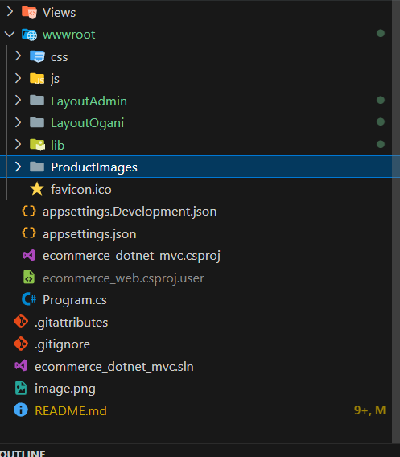

# Ecomerce MVC

## 1. Dowload source code
- Clone project về máy bằng lệnh: 
```sh
git clone https://github.com/nhao2003/ecommerce_dotnet_mvc.git
```

## 2. Dowload images
- Dowload Images [link](https://drive.google.com/file/d/1bFD3kwaxgxsV7oiPAxmG1vX52dUY-u4A/view)

## 3. Thêm hình ảnh vào project


## 4. Run Project
- Client: https://localhost:5050
- Admin: https://localhost:5050/admin
